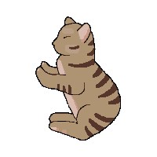

# bloomingcats

I created this branch as a companion branch to my talk at JS@PayPal 2021
To get started:
1. clone this branch and make sure you're on the SSR branch when running this locally
2. install: `npm i`
3. build: `npm run build`
4. navigate to http://localhost:3000

Differential Serving happens both in the /src/server/renderer.jsx file, webpack configuration and also babelPublicConfig.js

SSR code splitting is route based only at the moment and you can see that logic in /src/client/components/home as well as the @loadable/component extractors in /src/server/renderer.jsx

You can see SSR in action by navigating to the different routes `/', '/game' and '/rules'
Witness the different route based chunks being requested dynamically at runtime and also attached via script tag server side!

To see how I made this client-side app SSR capable check out my past few commits on this branch. This also shows how I added in SSR code splitting and also Differential Serving.

## A fun game with cats
https://www.kittenpop.net

 
 

