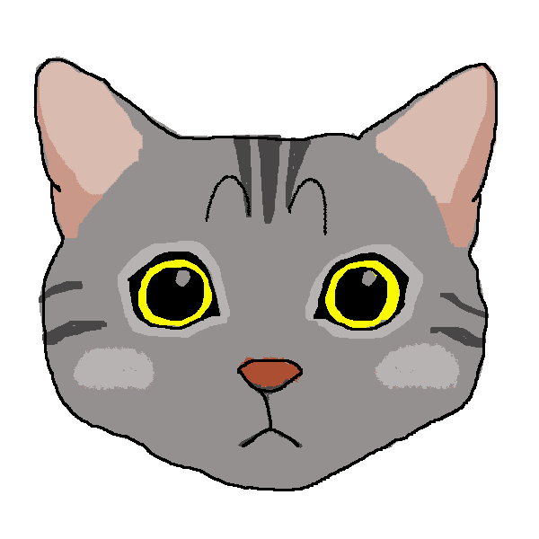

# bloomingcats

I created this branch as a companion repo to my talk at JS@PayPal 2021

**I hope to demonstrate** 
* SSR code splitting with https://github.com/gregberge/loadable-components
* Differential Serving with [babel](https://github.com/babel/babel), [core-js](https://github.com/zloirock/core-js) and [browserslist](https://github.com/browserslist/browserslist-useragent)
* How to build a JS web app that works on mobile and desktop using [react-dnd](https://github.com/react-dnd/react-dnd)

You can see the client-side rendered version of this app hoted live at https://www.kittenpop.net
This repo transforms this live version to SSR for purposes of this demo.

To get started:
Requirements: Node >= 12.16 and NPM >= 6
1. clone this branch `git clone https://github.com/MichaelDurfey/bloomingcats.git`
2. install: `npm i`
3. build: `npm run build`
4. start: `npm start`
5. navigate to http://localhost:3000

Differential Serving happens both in the /src/server/renderer.jsx file, webpack configuration and also babelPublicConfig.js

SSR code splitting is route based only at the moment and you can see that logic in /src/client/components/home as well as the @loadable/component extractors in /src/server/renderer.jsx

You can see SSR in action by navigating to the different routes `/', '/game' and '/rules'
Witness the different route based chunks being requested dynamically at runtime and also attached via script tag server side!

To see how I made this client-side app SSR capable check out my past few commits on this branch. This also shows how I added in SSR code splitting and also Differential Serving.

## Happy coding

 
 

